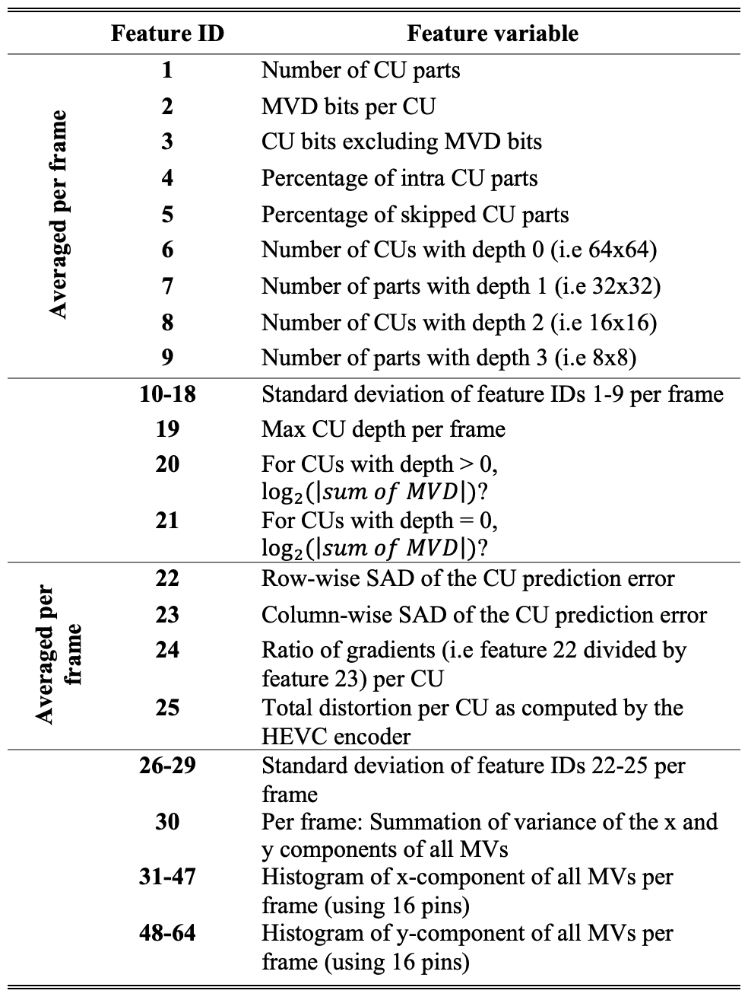

# **HEVC-SVS Datasets**

#### Proposed HEVC feature sets along with CNN features from GoogleNet, AlexNet, Inception-ResNet-V2, and VGG16 for TVSum, SumMe, OVP and VSUMM datasets. The new modified datasets names are "HEVC-SVS-TVSum", "HEVC-SVS-SumMe", "HEVC-SVS-OVP" and "HEVC-SVS-VSUMM", respecively.

#### The datasets contain the original ground truth data they came with, and these stayed unmodified.

## The datasets can be downloaded from Google Drive [here](https://drive.google.com/drive/folders/1s1RfJTeAesyTQdwOuOSdV3PrZ5r6gbKz?usp=sharing).

#### The following are the HEVC features with their descriptions:



## Upon using any of these datasets, please do cite our publication where we proposed the HEVC feature set for the first time:

### If you are using (HEVC-SVS-OVP) and/or (HEVC-SVS-VSUMM) dataets:
```
O. Issa and T. Shanableh, "CNN and HEVC Video Coding Features for Static Video Summarization," in IEEE Access, 2022, doi: 10.1109/ACCESS.2022.3188638.Online: https://ieeexplore.ieee.org/document/9815254
```
### If you are using (HEVC-SVS-TVSum) and/or (HEVC-SVS-SumMe) dataets:
```
PENDING
```
### Make sure to also cite the original authors for each of the datasets:

### TVSum:
```
@INPROCEEDINGS{7299154,
  author = {Yale Song and Vallmitjana, Jordi and Stent, Amanda and Jaimes, Alejandro},
  booktitle = {2015 IEEE Conference on Computer Vision and Pattern Recognition (CVPR)}, 
  title = {TVSum: Summarizing web videos using titles}, 
  year = {2015},
  volume = {},
  number = {},
  pages = {5179-5187},
  doi = {10.1109/CVPR.2015.7299154}
}
```

### SumMe:
```
@inproceedings{GygliECCV14,
   author ={Gygli, Michael and Grabner, Helmut and Riemenschneider, Hayko and Van Gool, Luc},
   title = {Creating Summaries from User Videos},
   booktitle = {ECCV},
   year = {2014}
}
```

### OVP and VSUMM:
```
@article{Avila,
    title = "VSUMM: A mechanism designed to produce static video summaries and a novel evaluation method",
    journal = "Pattern Recognition Letters",
    volume = "32",
    number = "1",
    pages = "56 - 68",
    year = "2011",
    note = "<ce:title>Image Processing, Computer Vision and Pattern Recognition in Latin America</ce:title>",
    issn = "0167-8655",
    doi = "10.1016/j.patrec.2010.08.004",
    author = "Sandra Eliza Fontes de Avila and Ana Paula Brand„o Lopes and Antonio da Luz Jr. and Arnaldo de Albuquerque Ara˙jo",
}
```


